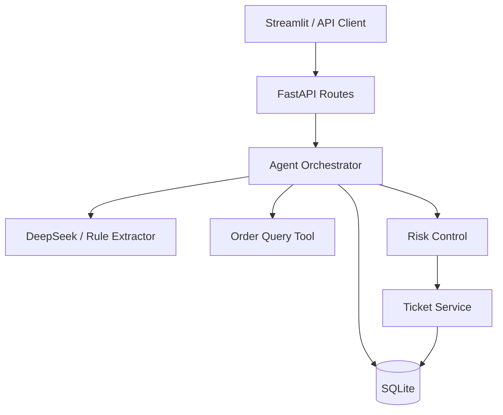

# 带状态售后客服 Agent

一个面向售后场景的可运行 Agent 应用：通过多轮对话收集用户信息，调用订单查询工具，并将退款等高风险请求转换为需要人工审核的持久化工单。

## 核心能力

- DeepSeek 结构化信息抽取，失败时降级为本地规则提取器
- 会话状态与消息历史持久化，服务重启后可以恢复
- 受控订单查询工具，业务代码决定路由而非让模型直接操作数据库
- 高风险请求转人工，并自动创建幂等工单
- 工单状态机：`pending_review → approved/rejected`，`approved → resolved`
- 人工接口使用 `X-Admin-Token` 进行最小权限保护
- FastAPI API、Streamlit 演示页面和 pytest 自动化测试

## 系统结构



Agent 的单轮执行顺序：

1. 保存用户消息并恢复会话状态；
2. 将自然语言抽取成结构化字段；
3. 信息不完整时继续追问；
4. 信息完整后先验证订单；
5. 普通请求返回订单结果；
6. 高风险请求创建人工审核工单；
7. 保存状态和 Agent 回复。

## 本地运行

要求 Python 3.10+。

```bash
python -m venv .venv
# Windows CMD: .venv\Scripts\activate
# PowerShell:   .venv\Scripts\Activate.ps1
python -m pip install -r requirements.txt
```

复制环境变量示例并填写本地配置：

```bash
copy .env.example .env
```

至少需要修改：

```env
INFORMATION_EXTRACTOR_MODE=deepseek
DEEPSEEK_API_KEY=your-key
ADMIN_API_KEY=your-random-admin-token
```

初始化可重复使用的演示订单：

```bash
python -m scripts.seed_demo_data
```

分别启动后端与前端：

```bash
fastapi dev app/main.py
streamlit run frontend/streamlit_app.py
```

- API 文档：http://127.0.0.1:8000/docs
- Streamlit：http://localhost:8501

## 主要接口

| 方法 | 路径 | 作用 | 权限 |
|---|---|---|---|
| `GET` | `/health` | 健康检查 | 公开 |
| `GET` | `/orders/{order_id}` | 查询订单 | 公开演示 |
| `POST` | `/sessions` | 创建会话 | 公开 |
| `GET` | `/sessions/{session_id}` | 恢复会话状态 | 会话 ID |
| `POST` | `/sessions/{session_id}/runs` | 执行一轮 Agent | 会话 ID |
| `GET` | `/sessions/{session_id}/messages` | 查询消息历史 | 会话 ID |
| `GET` | `/sessions/{session_id}/ticket` | 查询工单进度 | 会话 ID |
| `GET` | `/tickets/{ticket_id}` | 人工查看工单 | 管理员令牌 |
| `PATCH` | `/tickets/{ticket_id}/status` | 人工审核/完成工单 | 管理员令牌 |

人工接口请求头示例：

```http
X-Admin-Token: value-from-your-env
```

## 验证

```bash
python -m pytest -v
```

测试使用临时 SQLite 数据库和规则提取器，不调用真实 DeepSeek API，因此可重复运行且不会产生模型费用。测试覆盖会话恢复、消息持久化、订单异常、模型降级、风险路由、幂等建单、管理员鉴权和工单状态转换。

## 安全边界与限制

- 模型只负责结构化抽取，不直接执行 SQL 或修改工单。
- 退款等高风险操作只创建待审核工单，不执行真实支付操作。
- `.env` 和本地数据库被 Git 忽略，真实密钥不得提交。
- `X-Admin-Token` 是演示项目的最小权限边界；生产环境应替换为用户身份认证、角色授权、审计日志、限流和密钥管理服务。
- 当前使用 SQLite，适合单机演示；多实例部署应迁移到支持并发事务的数据库。
- 当前规则和测试覆盖的是有限售后意图，不代表可直接用于生产客服。
